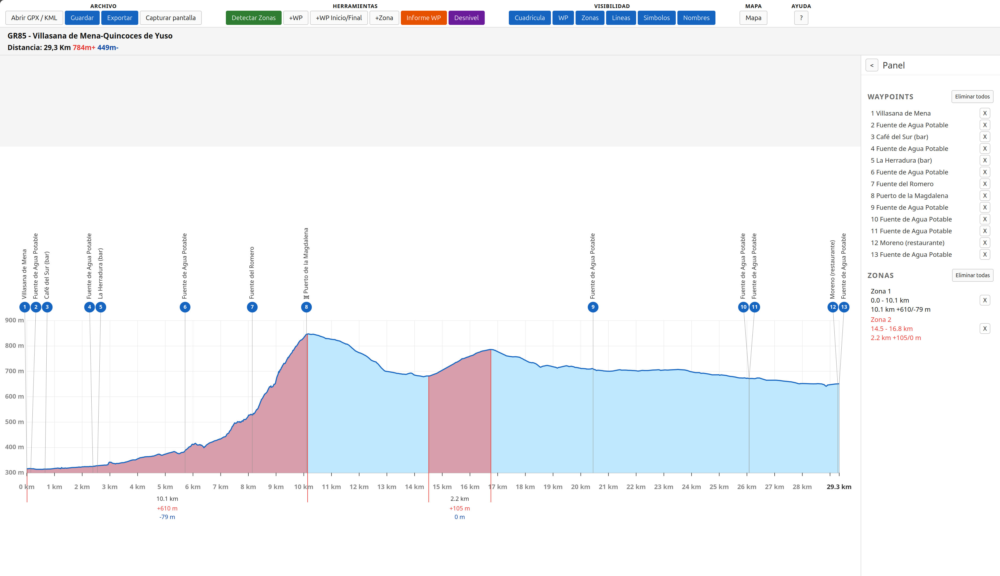

# Editor de Perfiles Topográficos — Versión Web


Editor interactivo de perfiles topográficos a partir de tracks **GPX/KML**: visualización del perfil con desnivel, detección de zonas de subida/bajada, gestión de waypoints e informe, y un mapa con puntos de interés. Es la versión web del proyecto de escritorio [**editor-perfiles**](https://github.com/Kasi-drum/editor-perfiles).




## Enlace

- **Producción (Vercel):** [https://editor-perfiles-web.vercel.app](https://editor-perfiles-web.vercel.app)

## Características

- **Abrir GPX / KML** — carga un archivo de track y dibuja el perfil con su desnivel.
- **Detectar Zonas** — analiza automáticamente los segmentos de subida/bajada.
- **+WP / +Zona / +WP Inicio/Final** — añade waypoints y zonas manualmente.
- **Informe WP** — exporta un informe tabulado de los waypoints (SVG/PNG/JPG).
- **Desnivel** — configura el umbral y la ventana de suavizado del cálculo.
- **Mapa** — abre el mapa del recorrido (Leaflet) con múltiples capas base (OpenTopoMap, OSM, IGN 1:25000, Satélite), permite añadir/eliminar waypoints sobre el track y buscar puntos de interés (agua, refugios, puertos, picos, bares) vía Overpass.
- **Exportar mapa** — descarga una imagen del mapa (PNG/JPG) con la vista actual: solo la capa base + el track (color y grosor) + los waypoints, sin controles UI. Nombre `mapa_track_<archivo>.<ext>`.
- **Guardar** — descarga una copia del track con los waypoints en GPX o KML.
- **Exportar** — guarda el perfil como PNG, JPG o SVG.
- **Visibilidad** — muestra/oculta cuadrícula, waypoints, zonas, líneas, símbolos y nombres.

## Uso

1. **Abrir GPX / KML** para cargar un track y generar su perfil.
2. **Detectar Zonas** para analizar subidas y bajadas.
3. Usa **+WP / +Zona** para completar el diseño del recorrido; también con clic derecho en el perfil o en el mapa.
4. **Mapa** para revisar el recorrido, buscar POIs y añadir waypoints sobre la ruta.
5. **Exportar / Guardar** para obtener la imagen o la copia del archivo.

En el mapa: clic derecho sobre el track crea un waypoint; con uno seleccionado, `X`/`Supr` lo elimina.

## Estructura del proyecto

```
index.html               ventana principal
mapa.html                ventana del mapa (Leaflet)
app.js                   lógica de la ventana principal
mapa.js                  lógica del mapa (Leaflet + Overpass + exportación)
profileCanvas.js         renderizado del perfil
export.js                exportación del perfil (PNG/JPG/SVG)
elevation.js             cálculo de desnivel
gpxParser.js / kmlParser.js   parsers de track
grid.js                  cuadrícula del perfil
styles.css
api/overpass.js          función Serverless (Vercel) que hace de proxy de Overpass
```

## Despliegue (Vercel)

Es una aplicación **estática** (HTML/CSS/JS, sin paso de build): la carpeta se sube tal cual. La única excepción es `api/overpass.js`, una función Serverless de Node que actúa de **proxy** para consultar Overpass/la OSM y evitar problemas de CORS desde el navegador.

- La carpeta `.vercel/` (vinculación local del proyecto y credenciales) está **ignorada** en git.
- Desplegar: `vercel --prod` dentro de la carpeta del proyecto.

## Notas

- Dependencias externas por CDN: **Leaflet** y **leaflet-image**.
- Los POIs se obtienen de **Overpass API** (OpenStreetMap).
- Requiere conexión a internet para cargar tiles del mapa, POIs y el ejemplo `datos-ejemplo.gpx`.
- Versión de escritorio (Electron/AppImage): [editor-perfiles](https://github.com/Kasi-drum/editor-perfiles).

## Licencia

MIT · © 2026 Kasi-drum. Ver [LICENSE](LICENSE).
